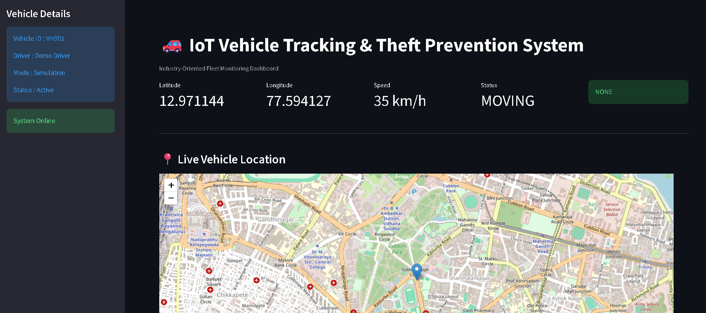
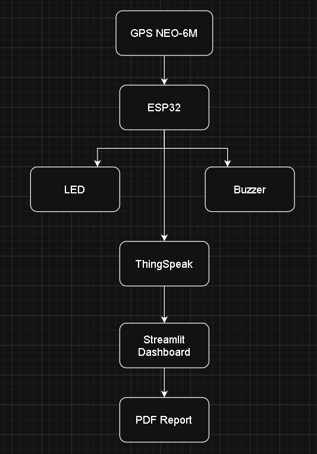
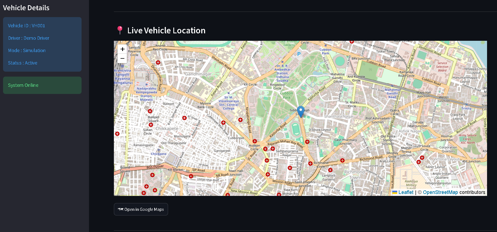
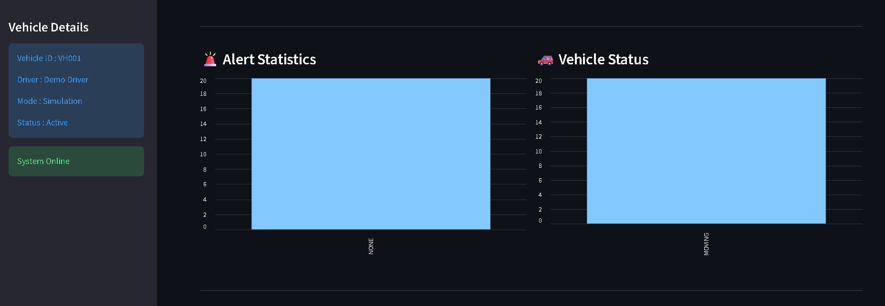
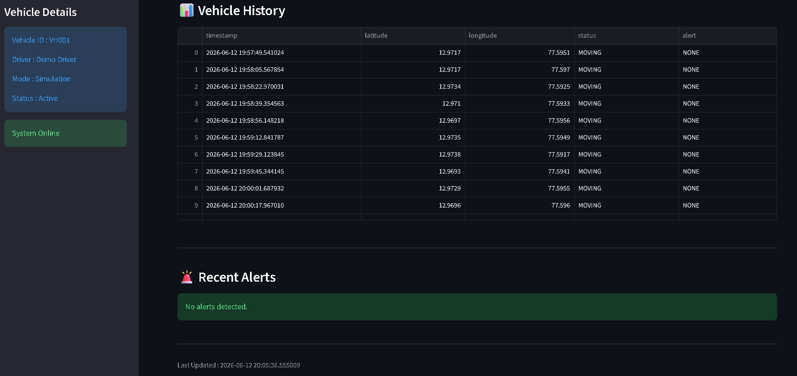
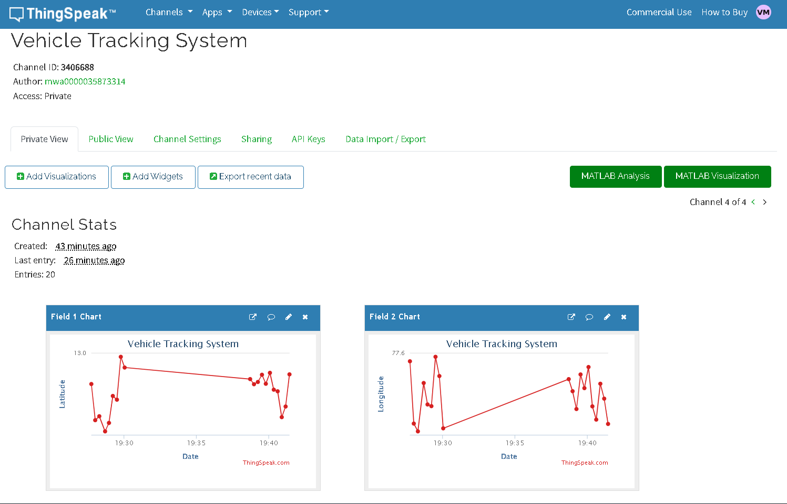

# 🚗 IoT Vehicle Tracking & Theft Prevention System

### Real-Time Vehicle Monitoring, Geofencing & Theft Detection using IoT, GPS Simulation, ThingSpeak Cloud, and Streamlit Dashboard

<p align="center">
  
</p>

<p align="center">
Real-Time Vehicle Tracking • Geofencing • Theft Detection • ThingSpeak Cloud • Streamlit Dashboard
</p>


---

## 📖 Overview

The **IoT Vehicle Tracking & Theft Prevention System** is an industry-oriented IoT solution designed to provide:

* Real-time vehicle monitoring
* GPS location tracking
* Geofencing alerts
* Theft detection
* Cloud connectivity
* Interactive dashboard visualization

The system simulates vehicle movement, uploads GPS coordinates to the ThingSpeak IoT Cloud platform, and visualizes live data through a professional Streamlit dashboard.

This project demonstrates how modern IoT technologies can be applied to vehicle security, fleet management, logistics tracking, and intelligent transportation systems.

---

## 🌐 Live Dashboard

### Streamlit Cloud Deployment

https://iot-vehicle-tracking-theft-prevention-system-632ddnbtrfpp2pxfh.streamlit.app/

---

## 💻 GitHub Repository

https://github.com/Vayu-143/IoT-Vehicle-Tracking-Theft-Prevention-System

---

## ✨ Key Features

### 📍 Real-Time Vehicle Tracking

* Live GPS coordinate monitoring
* Dynamic location updates
* Interactive vehicle tracking map
* Google Maps integration

### 🚨 Theft Detection

* Unauthorized movement detection
* Instant theft alerts
* Alert history monitoring

### 🛰 Geofencing

* Safe zone boundary monitoring
* Geofence breach detection
* Automatic geofence alerts

### ☁ ThingSpeak Cloud Integration

* Real-time IoT data transmission
* Cloud-based monitoring
* Historical data storage

### 📊 Professional Dashboard

* Live KPI cards
* Interactive location map
* Alert analytics
* Vehicle history records
* Real-time updates

### 📄 Automated Reporting

* PDF report generation
* Vehicle activity logs
* Alert summaries

---

## 🏗 System Architecture



The system follows a cloud-connected IoT architecture where simulated GPS data is generated locally, transmitted to ThingSpeak Cloud, and visualized through a real-time Streamlit dashboard.

```text
GPS Simulator
      │
      ▼
Vehicle Data Generation
      │
      ▼
ThingSpeak IoT Cloud
      │
      ▼
Streamlit Dashboard
      │
      ▼
Real-Time Monitoring
```

---

## 🔧 Technology Stack

### Programming Language

* Python 3.12

### IoT Platform

* ThingSpeak Cloud

### Dashboard Framework

* Streamlit

### Mapping & Visualization

* Folium
* Google Maps

### Data Processing

* Pandas

### Reporting

* ReportLab

### Charts & Analytics

* Streamlit Charts

---

## 📂 Project Structure

```text
IoT-Vehicle-Tracking-Theft-Prevention-System
│
├── arduino_code/
│
├── circuit_diagram/
│   └── vehicle_tracking_architecture.png
│
├── dashboard/
│
├── data/
│   └── vehicle_log.csv
│
├── docs/
│
├── images/
│   ├── analytics.png
│   ├── dashboard_home.png
│   ├── live_map.png
│   ├── thingspeak_dashboard.png
│   └── vehicle_history.png
│
├── outputs/
│   └── vehicle_report.pdf
│
├── python_simulation/
│   ├── __init__.py
│   ├── gps_simulator.py
│   ├── geofence.py
│   ├── logger.py
│   ├── pdf_report.py
│   └── thingspeak_sender.py
│
├── reports/
│
├── dashboard.py
├── main.py
├── requirements.txt
└── README.md
```

---

## ⚙ Installation

### Clone Repository

```bash
git clone https://github.com/Vayu-143/IoT-Vehicle-Tracking-Theft-Prevention-System.git

cd IoT-Vehicle-Tracking-Theft-Prevention-System
```

### Create Virtual Environment

```bash
python -m venv venv
```

### Activate Virtual Environment

#### Windows

```bash
venv\Scripts\activate
```

#### Linux / macOS

```bash
source venv/bin/activate
```

### Install Dependencies

```bash
pip install -r requirements.txt
```

---

## 🚀 Running the Project

### Step 1: Start GPS Simulation

```bash
python main.py
```

or

```bash
python python_simulation/gps_simulator.py
```

The simulator continuously generates GPS coordinates and sends them to ThingSpeak Cloud.

---

### Step 2: Launch Dashboard

```bash
streamlit run dashboard.py
```

Dashboard URL:

```text
http://localhost:8501
```

---

## ☁ ThingSpeak Configuration

Create a ThingSpeak channel and configure the following fields:

| Field   | Description    |
| ------- | -------------- |
| Field 1 | Latitude       |
| Field 2 | Longitude      |
| Field 3 | Vehicle Status |
| Field 4 | Alert Type     |
| Field 5 | Speed          |

### Write API Key

```python
WRITE_API_KEY = "YOUR_WRITE_API_KEY"
```

### Read API Key

```python
READ_API_KEY = "YOUR_READ_API_KEY"
```

### Channel ID

```python
CHANNEL_ID = "YOUR_CHANNEL_ID"
```

---

## 📊 Dashboard Modules

### KPI Cards

* Latitude
* Longitude
* Speed
* Vehicle Status
* Alert Status

### Live Map

* Real-time vehicle position
* Interactive Folium map
* Google Maps redirection

### Analytics

* Alert statistics
* Vehicle status statistics

### Vehicle History

* Historical GPS records
* Status logs
* Location records

### Alert History

* Theft alerts
* Geofence alerts
* Alert timeline

---

## 🔐 Theft Prevention Workflow

```text
Vehicle Movement
        │
        ▼
Location Monitoring
        │
        ▼
Geofence Check
        │
 ┌──────┴──────┐
 │             │
Inside      Outside
 │             │
 ▼             ▼
Normal     Alert Generated
                │
                ▼
        Theft Detection
                │
                ▼
       Dashboard Notification
```

---

## 📸 Project Screenshots

### 🏠 Dashboard Home


The main dashboard displays vehicle status, live telemetry, controls, and system health information.

---

### 📍 Live Vehicle Tracking



Interactive Folium-based map showing the real-time vehicle position with Google Maps integration.

---

### 📊 Analytics Dashboard



Visual representation of alert statistics, vehicle status trends, and operational insights.

---

### 📜 Vehicle History



Historical vehicle records including timestamps, coordinates, status updates, and alerts.

---

### ☁ ThingSpeak Cloud Integration



Live IoT data transmission and monitoring through the ThingSpeak Cloud Platform.

---

## 📚 Applications

* Fleet Management
* Vehicle Security Systems
* Logistics Monitoring
* Asset Tracking
* Smart Transportation
* Industrial Vehicle Monitoring
* Research & Academic Projects

---

## 🔮 Future Enhancements

* ESP32 Hardware Integration
* GPS Module Integration
* GSM/SMS Alerts
* Mobile Application
* Firebase Integration
* MQTT Communication
* Machine Learning Based Theft Prediction
* Driver Behavior Analytics
* Route Optimization

---

## 👨‍💻 Author

### Vayunandan Mishra

B.Tech Student | Internet of Things (IoT)

Passionate about IoT Systems, Embedded Development, Cloud Computing, Data Analytics, and Real-Time Monitoring Solutions.

### Connect

* GitHub: https://github.com/Vayu-143
* Live Dashboard: https://iot-vehicle-tracking-theft-prevention-system-632ddnbtrfpp2pxfh.streamlit.app/

---

## 📜 License

This project is developed for educational, academic, and research purposes.

You may use, modify, and extend this project for learning and experimentation.

---

## ⭐ Support

If you found this project useful:

⭐ Star the repository

🍴 Fork the repository

📢 Share it with others

💡 Contribute improvements

---

<p align="center">
<b>Built with ❤️ using Python, Streamlit, ThingSpeak, and IoT Technologies</b>
</p>
